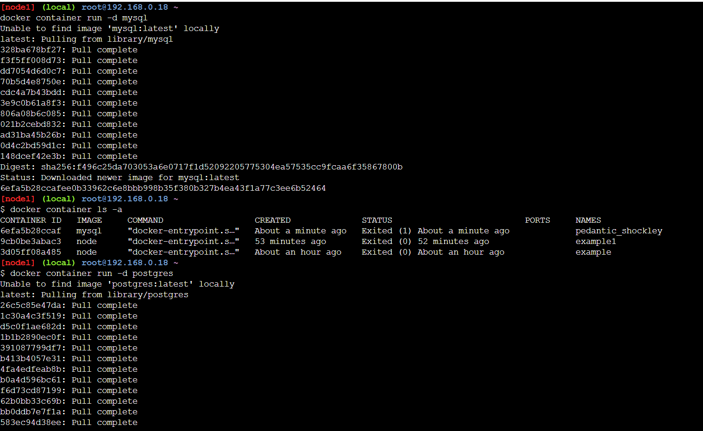
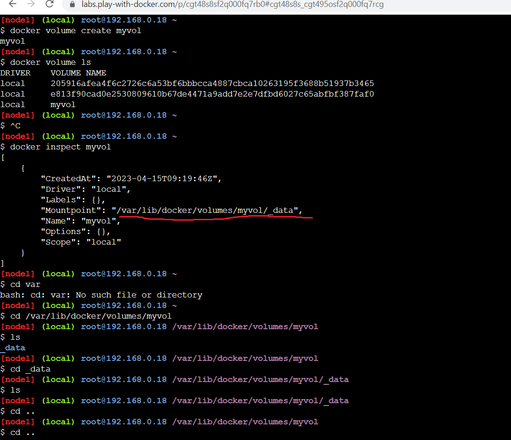
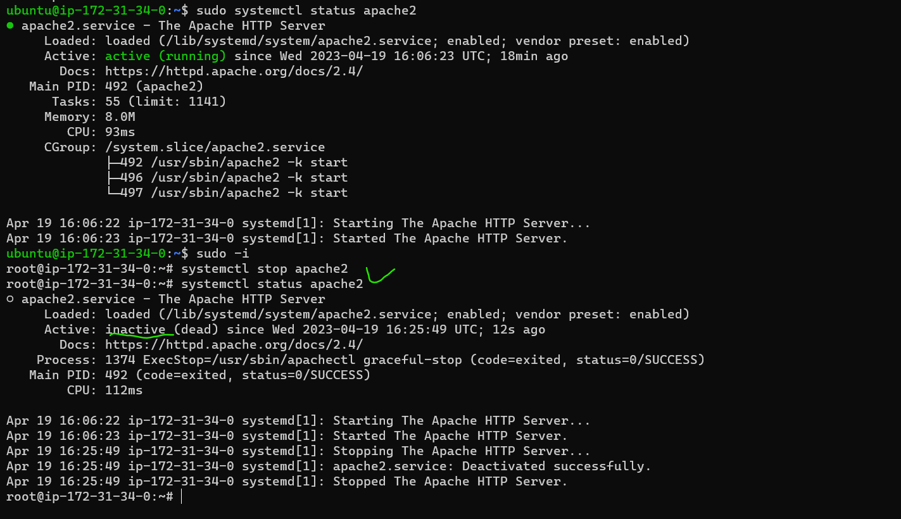

Experiments
---------------
1. Create a mysql container
create a postgresql container
list all the volumes
inspect all the volumes
create volume docker volume create myvol
inspect myvol
Figure out locations of volumes in your local systems

## answer

goto dockerhub playground execute this commands

```
docker container run -d mysql
docker container ls -a
docker container run -d postgres
docker container ls -a
docker volume ls
docker volume create myvol  #myvol is my volume name
docker volume ls
docker inspect myvol

```





Exercise:(12apr2023/directdevopsblog/devops class)
----------------
Create a ubuntu vm
install apache2 and note the ExecStart command for apache2
install tomcat9 and note the ExecStart command for tomcat9
stop the services (systemcl stop servicename)
become a root user (sudo -i)
2. try executing the ExecStart command directly and see if the application is running

# answer
* For apache
```
sudo apt update
sudo apt install apache2 -y
sudo systemctl start apache2
sudo systemctl status apache2
sudo systemctl stop apache2
sudo -i
systemctl status apache2
```


* For tomcat 
```
sudo apt-get update
sudo apt install openjdk-11-jdk
java -version
sudo useradd -m -U -d /opt/tomcat -s /bin/false tomcat
```
[Referhere](https://tomcat.apache.org/download-90.cgi)

wget https://dlcdn.apache.org/tomcat/tomcat-9/v9.0.74/bin/apache-tomcat-9.0.74.tar.gz

ls

tar xzvf apache-tomcat-9.0.73-fulldocs.tar.gz

sudo systemctl status tomcat9
sudo systemctl stop tomcat9
sudo -i
systemctl status tomcat9


