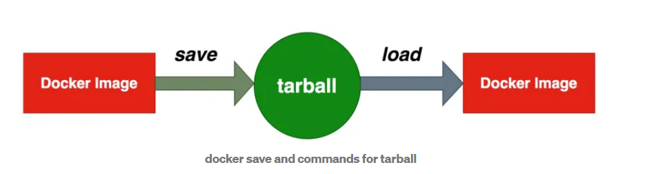
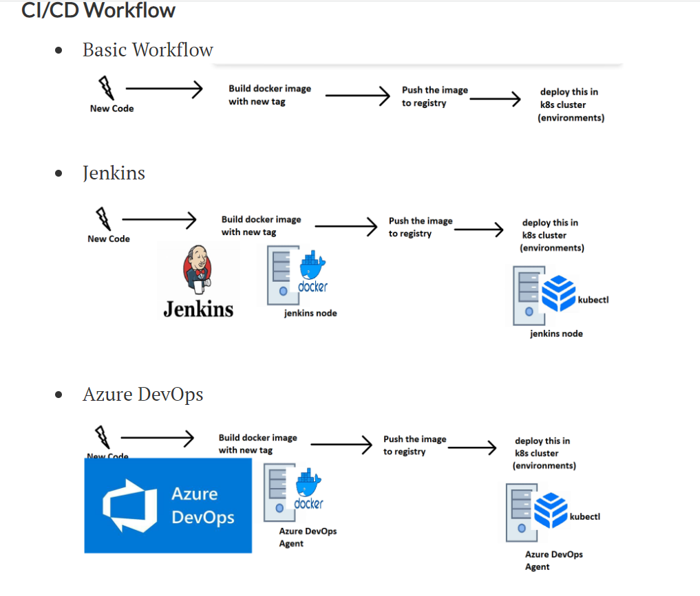

Interview questions
--------------------
# 1.Tell us about yourself?
 Thank you for giving this opportunity.
 My name is Archana i'm from hyd.
 coming about my education details 
 I complted my bachelor's techonology in PRRM engg college with stream of computes science in 2011
 and after that i'm working as a HR recrutier in AXIS technologies.
my hobbies are learn newthings and in the free time i do sudoku puzzles.
my goal:My long-term goal is to see myself in a respectable position, I am always looking for opportunities to learn and grow, and I believe that with hard work and dedication, I can achieve my career goals.
I'm self motivated and I'm very enthusiastic to learn new things for my career growth.
# 2.Explain Docker Images?
* A Docker image is a file used to execute code in a Docker container. Docker images act as a set of instructions to build a Docker container, like a template. Docker images also act as the starting point when using Docker. An image is comparable to a snapshot in virtual machine (VM) environments.

Docker is used to create, run and deploy applications in containers. A Docker image contains application code, libraries, tools, dependencies and other files needed to make an application run. When a user runs an image, it can become one or many instances of a container.

Docker images have multiple layers, each one originates from the previous layer but is different from it. The layers speed up Docker builds while increasing reusability and decreasing disk use. Image layers are also read-only files. Once a container is created, a writable layer is added on top of the unchangeable images, allowing a user to make changes.
[Referhere](https://www.techtarget.com/searchitoperations/definition/Docker-image)

# 3.What are different ways of building docker images?
* [Referhere](https://medium.com/bb-tutorials-and-thoughts/docker-three-ways-to-create-container-images-and-their-use-cases-ee651c0aceef)
* Three ways of Building Images
There are three ways to create container images while working with docker. Let’s explore these methods

        1.Interactively building Images
        2.Using Dockerfile
        3.Importing from a tarball
   * 1. Interactively building images:
   * In this way first we can pull the image from docker hub example i can pull the node:latest image from dockerhub
   * for that command is 
   * docker pull node:latest
   * Now we have base image ,so we can build the layers on top of this base image .for that we can run the container in detached mode,
   * docker container run -dit --name containername imagename
   * and next for goto inside the container  in intractive mode we can use this command
   * docker exec -it containername /bin/bash
   * next we can add files ,folders and build layers in the running container
   * next commit the changes in container with this command
   * docker container commit containername imagename
   * docker images ls
   * run the container in port
   * docker container run --name containername -d -p 3000:8000 imagename
  * 2. using dockerfile:
  * another way to build the image in docker withnuse of docker file we can build the image 
  * and the dockerfile is reusable
  * for that first we can write docker file with use of docker instructions(directories)
  * after that we can execute this commands
  * vi dockerfile 
  * dockerfile contains directories FROM,LABEL,COPY,ADD,EXPOSE,RUN,WORKDIR,ENV,ARG.
  * in that paste the dockerfile and next build the image and run the container

 * 3.Importing from a tarball
Let’s understand how tarballs work. If we have an image, we can save it into a tarball with docker save command and we can import the same image from the tarball wherever we need with docker load command.

docker save and commands for tarball
Let’s see this in action and use the image that we built above. use "docker save my-node-server > mynodeserver.tar." With this command, a tarball is created.
* Using Dockerfile
This is a common method to create images in production or testing. Most of the time we use this method
  

# 4.What is Dockerfile?
* Dockerfile: [Referhere](https://www.simplilearn.com/tutorials/docker-tutorial/what-is-dockerfile)
Dockerfile is a simple text file that consists of instructions to build Docker images.Dockerfile is a text document containing all the commands the user requires to call on the command line to assemble an image. With the help of a Dockerfile, users can create an automated build that executes several command-line instructions in succession.

# 5.How is container different than VM?
* [Referhere](https://learn.microsoft.com/en-us/virtualization/windowscontainers/about/containers-vs-vm)
* Containers and virtual machines (VMs) are both used to isolate and manage applications and their dependencies. However, there are some key differences between the two:
* Architecture: A VM is essentially an emulation of a physical machine, with its own operating system (OS), kernel, and virtualized hardware resources. In contrast, a container runs on top of a host operating system, sharing the kernel and other resources with other containers and the host system.

Resource usage: VMs typically require more resources (such as memory and disk space) than containers, since each VM runs its own OS and requires a separate set of resources. Containers, on the other hand, can share resources with other containers and the host system, resulting in more efficient resource usage.

Isolation: VMs provide complete isolation between the guest OS and the host system, since they run on virtualized hardware. Containers, while providing some level of isolation, share the same kernel and other resources with the host system and other containers, which can potentially create security risks.

Portability: Containers are generally more portable than VMs, since they do not require a separate OS to be installed. This means that containers can be easily moved between different systems or cloud environments, while VMs require more setup and configuration.

Startup time: Containers can be started and stopped much more quickly than VMs, since they do not need to boot a separate OS. This makes them more suitable for applications that need to scale quickly or respond to changing demand.

* containers are generally more lightweight and efficient than VMs, and are well-suited for running modern, distributed applications. VMs, on the other hand, provide stronger isolation and security guarantees, and are still widely used for legacy applications and systems that require dedicated hardware resources.
* 
# 6.Can you tell something about namespaces and how they are used in Docker?
* Docker uses a technology called namespaces to provide the isolated workspace called the container. When you run a container, Docker creates a set of namespaces for that container. These namespaces provide a layer of isolation. Each aspect of a container runs in a separate namespace and its access is limited to that namespace.

# 7.What is difference between ADD and COPY Instruction?
* COPY is a docker file command that copies files from a local source location to a destination in the Docker container. ADD command is used to copy files/directories into a Docker.
* ADD and COPY are two similar Dockerfile instructions which let you add content to your images at build time. Whereas COPY is a straightforward source to destination copy, ADD includes extra functionality for working with archives and remote URLs.

# 8.Can you explain the concept of Layers in Docker Image?
[Referhere](https://dzone.com/articles/docker-layers-explained)

# 9.What is the purpose of EXPOSE and VOLUME instruction in Dockerfile?

# 10.What is your workflow for CI/CD with Docker Containers and where do you store images?

* A version control system (VCS) is a unified source code repository that maintains code changes. This generates the trigger for a CI/CD tool to start the pipeline whenever a new change is pushed into its repository. Image registries store the Docker container images.
* Here is a high-level overview of a CI/CD workflow with Docker containers:

Developers push their code changes to a source code repository (e.g. GitHub).

A CI tool (e.g. Jenkins, Travis CI) checks out the code, builds a Docker image, and runs unit tests on the code.

If the unit tests pass, the CI tool pushes the Docker image to a registry (e.g. Docker Hub).

A CD tool (e.g. Kubernetes) deploys the Docker image to a staging environment for integration and acceptance testing.

If the staging tests pass, the CD tool deploys the Docker image to a production environment.

The CD tool monitors the application in production and automatically rolls back to a previous version if issues are detected.
* [Referhere](https://r.search.yahoo.com/_ylt=AwrKDx7QXklkSVoSXT27HAx.;_ylu=Y29sbwNzZzMEcG9zAzIEdnRpZAMEc2VjA3Nj/RV=2/RE=1682558801/RO=10/RU=https%3a%2f%2fthenewstack.io%2fkubernetes-ci-cd-pipelines-explained%2f%23%3a~%3atext%3dA%2520version%2520control%2520system%2520%2528VCS%2529%2520is%2520a%2520unified%2crepository.%2520Image%2520registries%2520store%2520the%2520Docker%2520container%2520images./RK=2/RS=a4ir6Nai51EN_DLj5b50i809ZbA-)