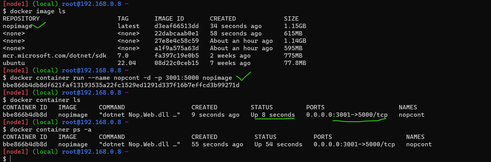
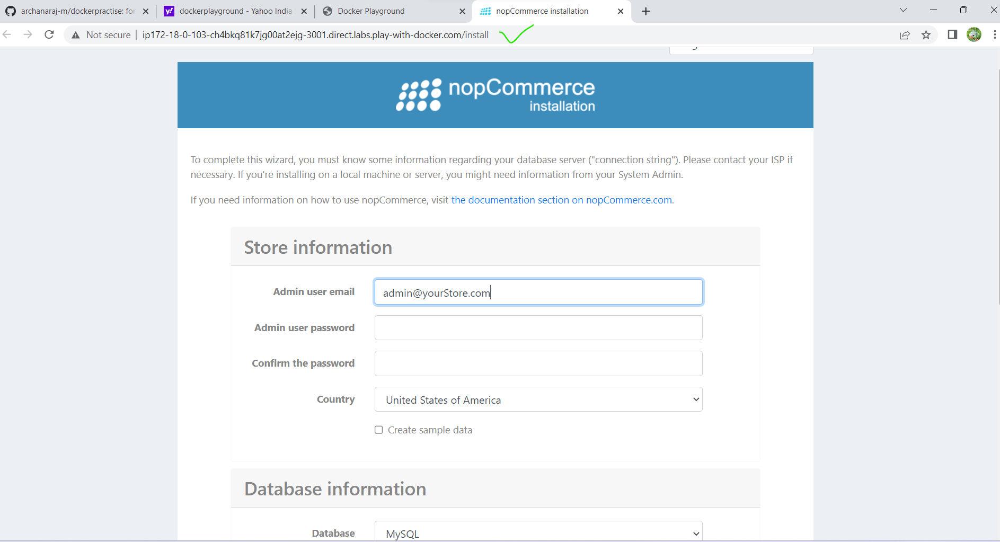
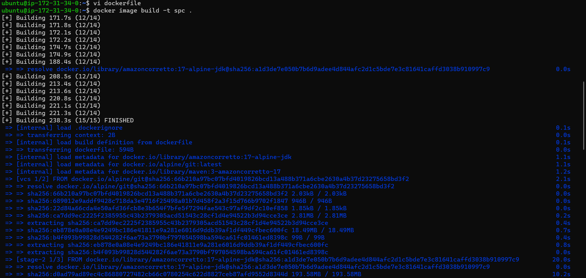
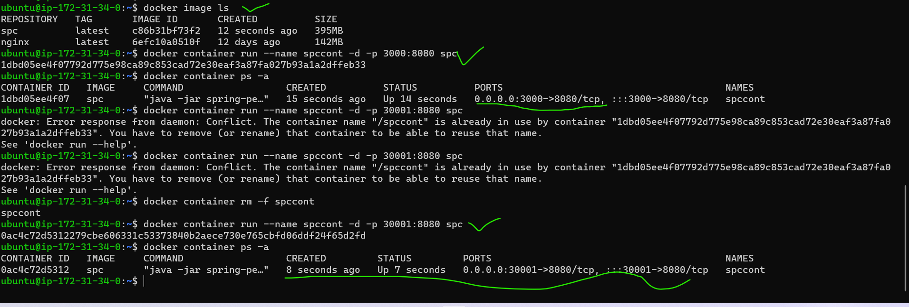
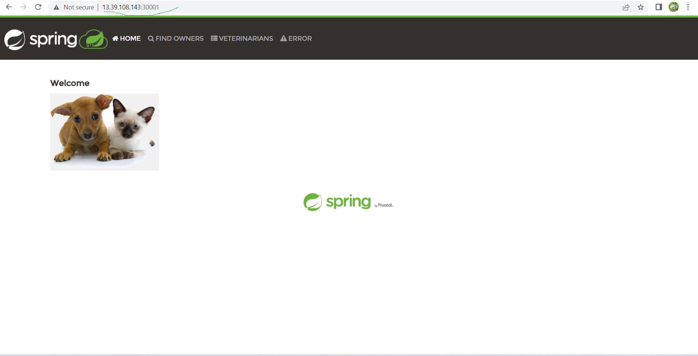
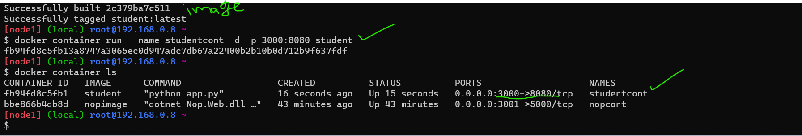
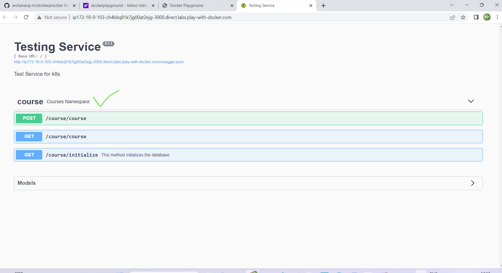

# dockerpractise
Docker Workshop-3 Activities (21/APR/2023) - Khaja Sir   
------------------------------------------------------------------------

# 1) Create a multi-stage docker file to build  
    a) nop commerce  
    b) spring petclinic
    c) student courses register
## a)nop commerce
* First we can write dockerfile with help of manual commands
* To build this application we need
    dotnet sdk7.0
* Manual steps:
  Download URL = https://github.com/nopSolutions/nopCommerce/releases/download/release-4.60.2/nopCommerce_4.60.2_NoSource_linux_x64.zip
  cd nop 

# Dockerfile
```
FROM ubuntu:22.04 As builder
RUN apt update && apt install unzip -y
ADD https://github.com/nopSolutions/nopCommerce/releases/download/release-4.40.2/nopCommerce_4.40.2_NoSource_linux_x64.zip /nop/nopCommerce_4.40.2_NoSource_linux_x64.zip
RUN cd nop && unzip nopCommerce_4.40.2_NoSource_linux_x64.zip && rm nopCommerce_4.40.2_NoSource_linux_x64.zip
FROM mcr.microsoft.com/dotnet/sdk:7.0
LABEL author="raji" organization="qt" project="learning"
COPY --from=builder /nop /nop-bin
WORKDIR /nop-bin
EXPOSE 5000
CMD [ "dotnet", "Nop.Web.dll", "--urls", "http://0.0.0.0:5000" ]

```
* After creating docker file past ie in $ vi dockerfile
* for build the image
```
docker build image -t nopimage .
docker image ls
docker container run --name nopcont -d -p 3001:5000 nopimage
docker container ls -a

```

* with use of that port number paste in dockerplayground then in newtab nop page came



## b)spring petclinic
* First we can write dockerfile with help of manual commands
* To build this application we need
    jdk17
    maven
    git
* Manual steps:
  git clone https://github.com/spring-projects/spring-petclinic.git
  cd spring-petclinic 
  mvn package
* that spc file gets created in target/spring-petclinic-*.jar

# Dockerfile
```
FROM alpine/git AS vcs
RUN cd / && git clone https://github.com/spring-projects/spring-petclinic.git && \
    pwd && ls /spring-petclinic

FROM maven:3-amazoncorretto-17 AS builder
COPY --from=vcs /spring-petclinic /spring-petclinic
RUN ls /spring-petclinic 
RUN cd /spring-petclinic && mvn package


FROM amazoncorretto:17-alpine-jdk
LABEL author="archana"
EXPOSE 8080
ARG HOME_DIR=/spc
WORKDIR ${HOME_DIR}
COPY --from=builder /spring-petclinic/target/spring-*.jar ${HOME_DIR}/spring-petclinic.jar
EXPOSE 8080
CMD ["java", "-jar", "spring-petclinic.jar"]
```
* Next copy and paste this dockerfile in our instance(vm) with use of below command
* vi dockerfile
* Next build the image
 ```
   docker image build -t spc .
 ```

* To check the image
```
  docker image ls
```
* Next create and run the container with this command
  ```
  docker container run --name spccont -d -p 3000:8080 spc
  docker container ps -a
  ```   

* go to newtab 
* instance public IP address/3001 then spc page came


## c)student cources register

* First create dockerfile with $ vi dockerfile
```
FROM alpine/git AS vcs
RUN cd / && git clone https://github.com/DevProjectsForDevOps/StudentCoursesRestAPI.git && \
    pwd && ls /StudentCoursesRestAPI

FROM python:3.8.3-alpine As Builder
LABEL author="archana" organization="qt" project="learning"
COPY --from=vcs /StudentCoursesRestAPI /StudentCoursesRestAPI
ARG DIRECTORY=StudentCourses
RUN cd / StudentCoursesRestAPI cp requirements.txt /StudentCourses
ADD . ${DIRECTORY}
EXPOSE 8080
WORKDIR StudentCoursesRestAPI
RUN pip install --upgrade pip
RUN pip install -r requirements.txt
ENTRYPOINT ["python", "app.py"]

```
* Next build the image
```
docker image build -t student .
docker image ls
docker container run --name studentcont -d -p 3000:8080 student
```

* with use of that port number paste in dockerplayground then in newtab student course register page came



# 2) Push these images to  
    a) AWS ECR
    b) Azure ACR


3) Write a docker compose file for
    a) Nop Commerce
    b) Spring petclinic
    c) Game of life
    d) Student Courses Register
